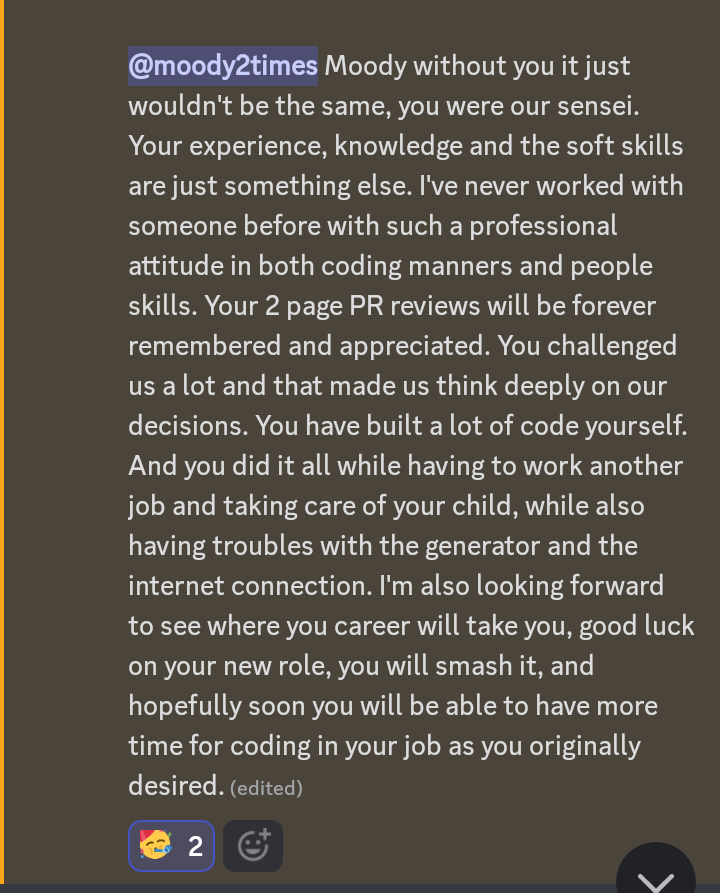

# Mudiaga Moody Uwojeya, Esq

A React and Nodejs developer with 4 years of experience

 

## About Me

- 👨‍💼 A freelancer
- 👯 Contributing to open source at [thumbnail-maker](https://github.com/Hermit-Tools/Thumbnail-Maker) and [CollAction](https://github.com/CollActionteam/collaction_website)
- 🔧 Currently collaborating to build Research Buddy
- 🧗 Cracking [JavaScript Algorithms and Data Structures](https://github.com/uwojeyamudiaga/javascript-algorithms-master)

 

  

 

 

<h3 align="left">Languages and Tools:</h3>

 

 

### Feedbacks

 

### Another part of me (because I like Michael Jackson)

- 🎸 Love playing on the guitar and reading manga
- 📝 Writing sonnets, haikus and poems. Find my [poems repository here](https://github.com/uwojeyamudiaga/poesy). I have been read 73172 times at [https://www.voicesnet.com/user/documents](https://www.voicesnet.com/user/documents)
- ⚡ Fun fact: I switched from legal practice to tech
- 📚 Currently learning Japanese and Spanish

<!--
**moody2times/moody2times** is a ✨ _special_ ✨ repository because its `README.md` (this file) appears on your GitHub profile.
-->
